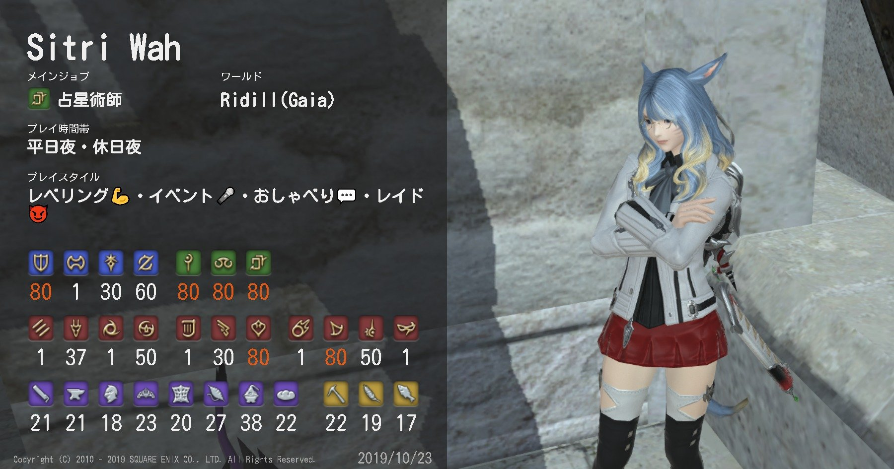

---
---

# しとりーのプロフィール

## 名前・ハンドルネーム

- NH: 上白沢 しとりー
- Primary ID: ndxbn
- Domain: ndxbn.tokyo

「しとりー」は、魔導書『ゴエティア』に登場する 72 柱の魔王の一柱[『シトリー』](https://ja.wikipedia.org/wiki/%E3%82%B7%E3%83%88%E3%83%AA%E3%83%BC)に由来しています。
天使や悪魔の名前をよく TRPG のキャラ名で使っていたのですが、その中でも『シトリー』に愛着があったので、そのまま拝借ました。

「上白沢」は、上海アリス幻樂団の『東方 Project』に登場する『[上白沢 慧音](https://dic.pixiv.net/a/%E4%B8%8A%E7%99%BD%E6%B2%A2%E6%85%A7%E9%9F%B3)』に由来しています。
妹紅も好きなのですが、さすがに藤原姓は使いたくなかったので、上白沢にしました。
東方に詳しい方は、読みを「かみしらさわ」か「わーはくたく」で迷うかもしれませんが、「かみしらさわ」です。

ちなみに、本名の名字は「鈴木」です。
ありふれた名字ですが、家系的にはありふれていなかったりします。（気が向いたらブログ記事に書きます）

英語で自分のハンドルネームを使うときは、普通に Sitri Kamishirasawa としています。
名字が長すぎて文字数制限に引っかかることが多々あるのが悩みです。

ID に使っている ndxbn は、[メイプルストーリーで使っていたメインキャラ](https://maplestory.nexon.co.jp/mypage/avatar/?oid=2030064139&nick=ndxbn)に由来します。
めいぽで使っていたキャラ名は、すべて左右対称っぽい文字列になっていました。

ドメイン名は、「東京在住の ndxbn 」です。
移住はしないつもりです。

## よく使うサービスのアカウント

主に使っているサービスのアカウントは、以下の通り。

- [Twitter: ndxbn](https://twitter.com/ndxbn)
- [GitHub: ndxbn](https://github.com/ndxbn)
- [Qiita: ndxbn](https://qiita.com/ndxbn)
- [FINAL FANTASY XIV](https://jp.finalfantasyxiv.com/lodestone/character/26361370/)
- [Gravatar: suzuki04](https://ja.gravatar.com/suzukik04)
- [読書メーター: 462571](https://bookmeter.com/users/462571)
- [小説家になろう: 546397](https://mypage.syosetu.com/546397/)（ROM 専）

あまり使わないけれど、以下のアカウントも自分です。

- [TwitCasting: ndxbn](https://twitcasting.tv/ndxbn/)
- [twilog: ndxbn](http://twilog.org/ndxbn)
- [twpf: ndxbn](http://twpf.jp/ndxbn)
- [niconico: 3506569](http://www.nicovideo.jp/user/3506569)
- [nana: 322522](https://nana-music.com/users/322522/)
- [pixiv: ndxbn](https://pixiv.me/ndxbn)
- [Instagram: sitri.ndxbn](https://www.instagram.com/sitri.ndxbn/)
- [ATND: 120916](https://atnd.org/users/120916)
- [connpass: ndxbn](https://connpass.com/user/ndxbn/)
- [chocolatey: sitri](https://chocolatey.org/profiles/sitri) （ndxbn は別の人なので注意！）

マストドンは、いくつか `ndxbn` アカウントは作りましたが、使っていないので割愛。

## Tech Stack

- 日本語
- PHP 7
- TypeScript
- MySQL
- Redis
- Ansible
- Vagrant
- Oracle VirtualBox

### OS / XaaS

- Windows 10
- ~~Windows Server 2012 R2~~ 自宅鯖で使っていたが、撤去済み。
- CentOS
- Google Cloud Platform

### 使ってるマシンやハードウェア

- [ASUS ROG G701VIK](https://www.asus.com/jp/Laptops/ROG-G701VIK/specifications/)
- [OKI C301dn](http://www.oki.com/jp/printing/products/color/discontinued/c301dn/index.html)
- Sony Xperia Series

## FF14

[ロドストのページはこちら](https://jp.finalfantasyxiv.com/lodestone/character/26361370/)。

『下限の民』という [CWLS](https://jp.finalfantasyxiv.com/lodestone/linkshell/27584547717760894/) / FS のマスターをやってます。
基本的には、「フェローシップに1週間分の予定を書き、PT募集を出し、下限の CWLS いくつかに情報を流す」だけです。
時期や時間帯によっては、人が集まらなくて中止ということも割とあります。

Sitri Wah というのは、意味としては「半ミコッテ半シトリー」です。
同様に、 Zepar-wah は「半[ゼパール](https://ja.wikipedia.org/wiki/%E3%82%BC%E3%83%91%E3%83%AB)」、 Gremory-wah は「半[グレモリー](https://ja.wikipedia.org/wiki/%E3%82%B0%E3%83%AC%E3%83%A2%E3%83%AA%E3%83%BC)」、 Fulmur-wah は「半[フール](https://ja.wikipedia.org/wiki/%E3%83%95%E3%83%AB%E3%83%95%E3%83%AB) [ムール](https://ja.wikipedia.org/wiki/%E3%83%A0%E3%83%AB%E3%83%A0%E3%83%AB)」 です。
（Fulmur は、ナイトウィザードの「[“風雷神”フール＝ムール](http://www.fear.co.jp/nw/dlc/nw3_dld_dlc/nw3_dld_dlc.htm)」も意識してます。）

Wah の家系は、名前にこそ悪魔が含まれており、意味も半ミコッテ半悪魔という[どこぞの厨二病部族](https://dic.pixiv.net/a/%E7%B4%85%E9%AD%94%E6%97%8F)のようになっていますが、生まれてきた子の外見の特徴やこうなってほしいという願望で、名前をつけているみたいです。

Wah 家の子たちは、皆なにかしらのフェイスペイントを入れています。
この家系では骨格がほぼ変わらないのですが、たまに同じような配色の子が同じ時代に二人以上いることがあるので、そういうときにわかりやすくするっていう目的もあるらしいです。
フェイスペイントは、ほとんどの子は思春期に自分の好きなものを入れてるみたいですが、たまに親が勝手に入れてることもあるみたいです。
（フェイスペイントって表現してますけど、全然落ちないし、刺青なのでは…？）

### ちょっとメタい話

#### "Wah" って姓はなに？ → 上白沢の "上"

Wah は、ワーハクタクの「ワー」に由来します。
ワーハクタクのワーは、半分という意味だと解釈されるのが主流だと思います。ワーハクタクは were-hakutaku ですが、[人名の命名ルール：ミコッテ編](http://forum.square-enix.com/ffxiv/threads/63038)にある通り、どこかに発音しない（無声摩擦音の） "H" を入れることが多いとされているので、入れました。

"H" は名に入っていることが多いことは確かですが、姓に入っている場合もあるようなので（例：シザ・エポカン、チェミ・ジンジャル、ジャ・ナンゴ・チャカ）、姓に。
名前は悪魔の名前をそのまま使うことにしており、姓に入れておいたほうが便利で都合が良かったので、Hを入れても発音しやすく、また、いろいろあとから設定を追加するにしても扱いやすいようにしました。
