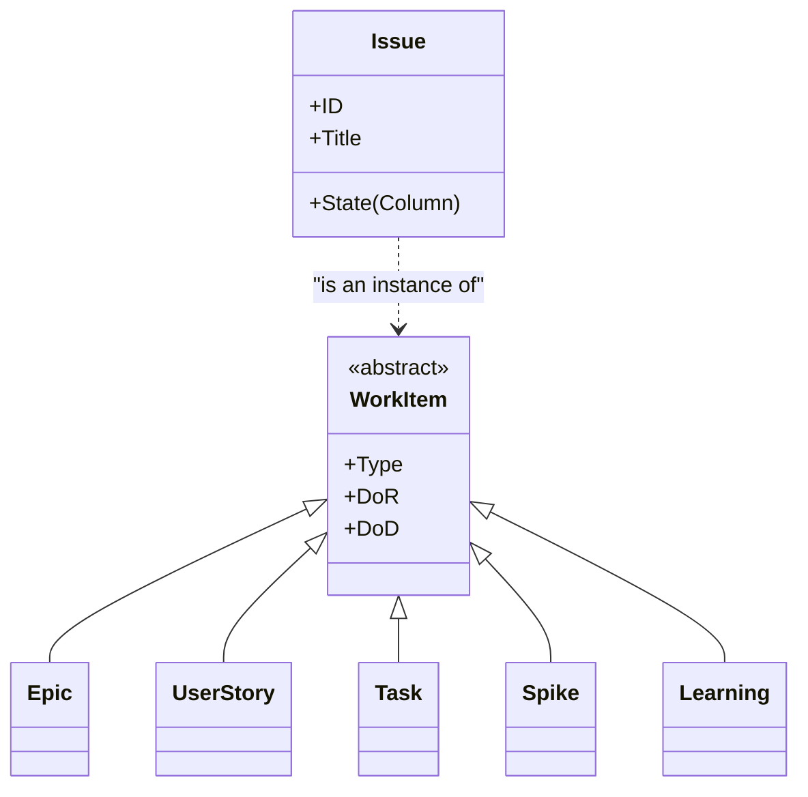
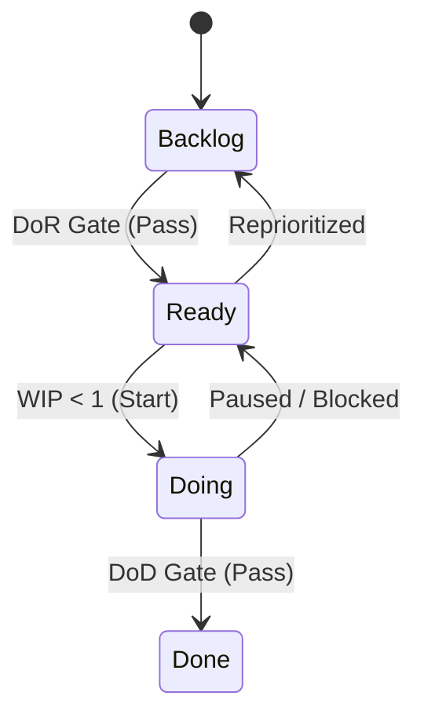

## 用語とか概要など

- アジャイル開発（[What is Agile?](https://www.atlassian.com/agile)）
- ISO 9000 シリーズ
- PMBOK

## 各種ダイアグラム
### タスクの種類と構造

```mermaid
classDiagram
    class WorkItem {
        <<abstract>>
        +Type
        +DoR
        +DoD
    }
    class Epic { }
    class UserStory { }
    class Task { }
    class Spike { }
    class Learning { }

    WorkItem <|-- Epic
    WorkItem <|-- UserStory
    WorkItem <|-- Task
    WorkItem <|-- Spike
    WorkItem <|-- Learning

    class Issue {
        +ID
        +Title
        +State (Column)
    }
    Issue ..> WorkItem : "is an instance of"
```

### Issue の状態遷移図

```mermaid
stateDiagram-v2
    [*] --> Backlog
    Backlog --> Ready : DoR Gate (Pass)
    Ready --> Doing : WIP < 1 (Start)
    Doing --> Done : DoD Gate (Pass)
    
    %% 差し戻しや優先度変更
    Doing --> Ready : Paused / Blocked
    Ready --> Backlog : Reprioritized
```
