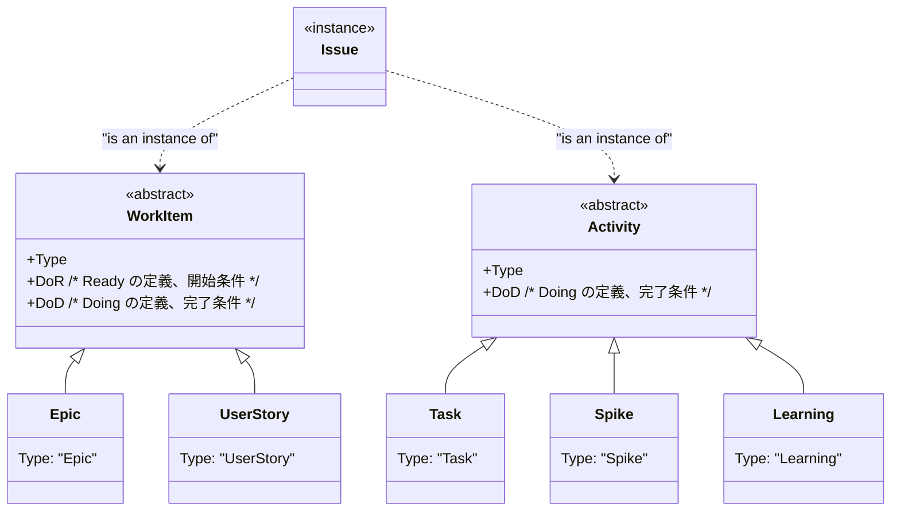
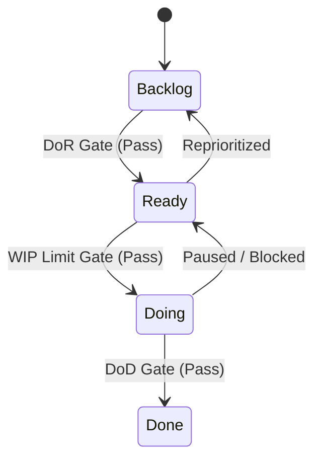

## 用語とか概要など

- アジャイル開発（[What is Agile?](https://www.atlassian.com/agile)）
- ISO 9000 シリーズ
- PMBOK

## 各種ダイアグラム
### タスクの種類と構造

- いわゆる「タスク」は、粒度の大きい順に Epic、UserStory、Task になる。
- Epic や UserStory にて DoR が明確になっていない場合に、それを明確にするためのタスクが Spike。
- 「Learning（勉強）」は、時間制限を設けないない、つまり工数やサイズの見積もり不要。

### Issue の状態遷移図

