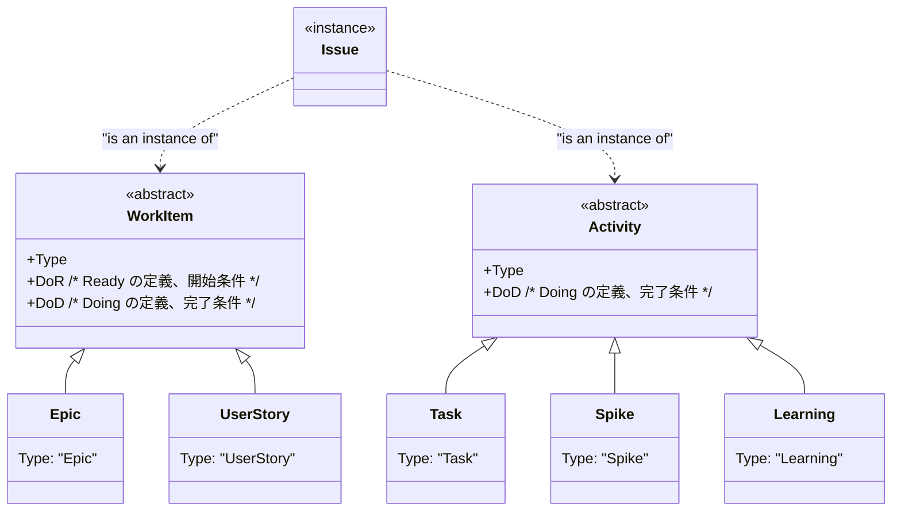
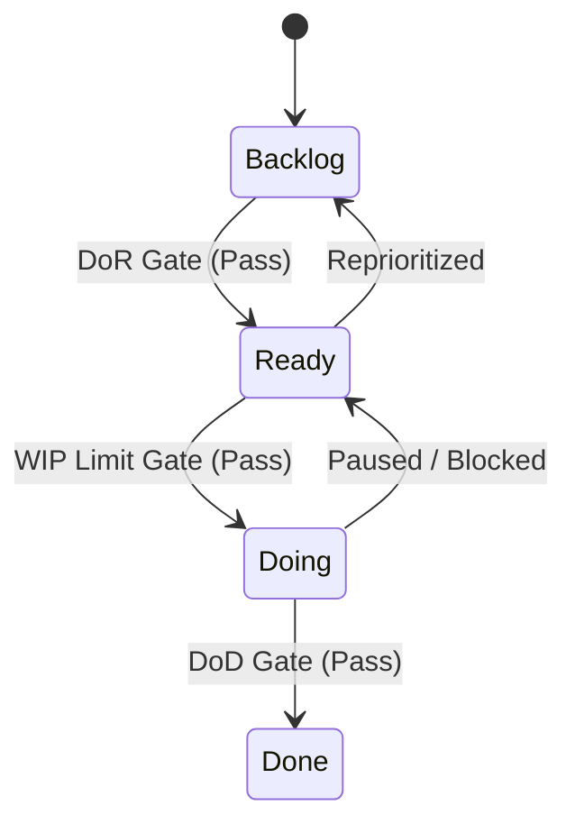

## 用語とか概要など

前提知識

- アジャイル開発（[Atlassian の Agile コーチ| What is Agile?](https://www.atlassian.com/agile)）
- ISO 9000 シリーズ
- PMBOK
- 『超上流から攻める IT 化の原理原則 17か条』（IPA）

用語

- Issue: WorkItem と Activity の基底クラスどちらかのインスタンス。GitHub Issues 上の実体。
- WorkItem: DoR が必要な「成果物」の基底クラス。Epic, UserStory がこれに属する。
- Activity: DoR が不要な「行動」の基底クラス。Task, Spike, Learning がこれに属する。
- GTDの概念: Stuff, InBox, Project（2ステップ以上。この用語は使わず、`WorkItem` で統一）, Next Action（1ステップで完了。この用語は使わず、 `Activity` で統一）
- GTDの５ステップ: Capture（収集）, Clarify（明確化）, Organize（整理）, Reflect（見直し）, Engage（実行）
- PMBOK: Project, Portfolio Management, WBS
- アジャイル開発の階層: Epic, UserStory, Task
- アジャイル開発の定義ゲート: DoD（Definition of Done / 完了の定義）, DoR（Definition of Ready / 準備完了の定義）
- アジャイル開発のプラクティス: Backlog Refinement（Grooming）, Iteration（アジャイル開発用語）と Sprint（スクラム用語）
- アジャイル開発の見積もり: t-shirt, StoryPoint, Velocity
- Spike の分類（この分類は使わない）: Technical Spike, Functional Spike
- Activity Node: 特に UML のアクティビティ図のアクティビティであることを強調したいときの表現（Issue のサブクラスの Activity に対して）
- Xxx Activity や Activity Class: Android アプリケーションの画面単位としての アクティビティであることを明確にしたいときの表現（Issue のサブクラスの Activity に対して）

## 各種ダイアグラム
### タスクの種類と構造

- いわゆる「タスク」は、粒度の大きい順に Epic、UserStory、Task になる。
- Epic や UserStory にて DoR が明確になっていない場合に、それを明確にするためのタスクが Spike。
- 「Learning（勉強）」は、時間制限を設けないない、つまり工数やサイズの見積もり不要。

### Issue の状態遷移図

